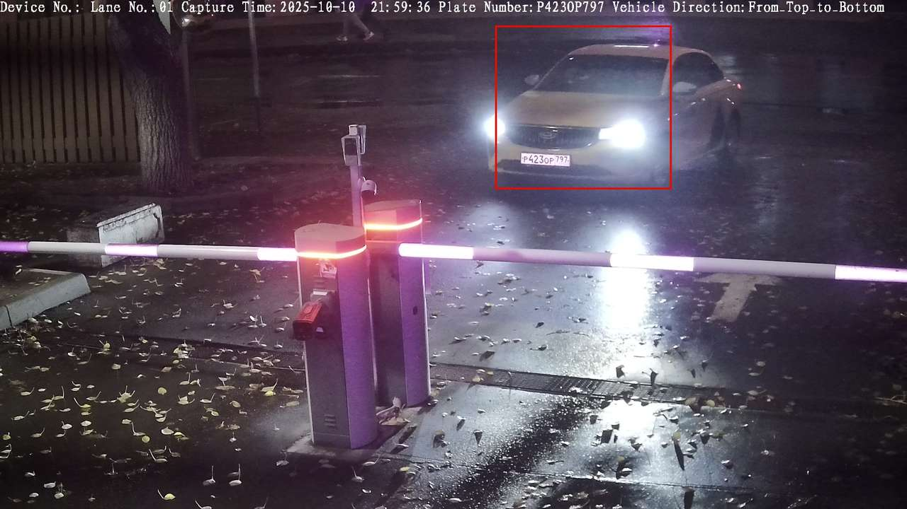
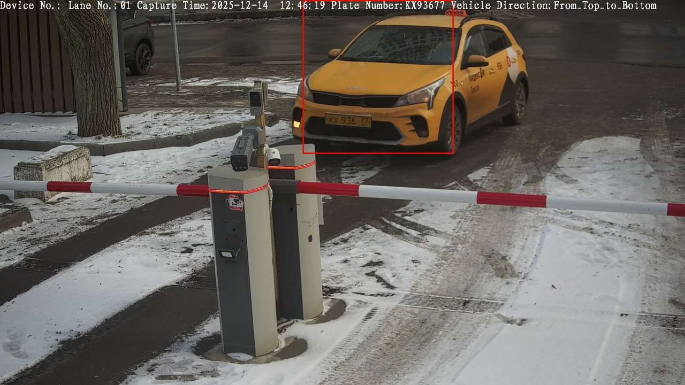

## QWX Systems Open-Source Core

Open-source distributed computer vision platform for real-time vehicle identification, Automatic License Plate Recognition (ALPR), smart parking automation, access control, and traffic analytics from regular IP camera streams.
QWX is designed as an extensible computer vision core that separates camera ingestion, queue orchestration, and recognition workers, enabling deployment from edge devices to large-scale cloud infrastructure.

---

## Project Status

QWX Systems Open-Source Core is currently under active development.
This repository contains the public architecture, roadmap, and open-source components of the platform.
Current focus areas:

Distributed ALPR pipeline
Multi-camera ingestion
OCR normalization engine
ARM64 optimization
Edge deployment support

Production deployments currently use internal components that are gradually being extracted into the public open-source core.

---

## Overview

Most ALPR systems depend on specialized cameras, vendor SDKs, or proprietary software.
QWX focuses on recognition from standard IP cameras and commodity infrastructure.
The platform processes camera frames, detects vehicles and license plates, performs OCR, normalizes plate numbers, and generates structured events that can be integrated with parking systems, access control platforms, ERP systems, analytics pipelines, and custom applications.

---

## Core Capabilities

-Real-time Automatic License Plate Recognition (ALPR)
-Vehicle detection from standard IP camera streams
-Multi-object vehicle tracking
-Distributed inference workers
-Queue-based asynchronous processing
-OCR extraction and normalization
-Confidence scoring and validation
-Smart parking automation
-Vehicle access control
-Traffic analytics and monitoring
-ARM64 cloud optimization
-Edge deployment support

---

## System Architecture

QWX uses a distributed micro-pipeline architecture separating API orchestration from compute-heavy computer vision inference.

Camera / RTSP / HTTP Stream
↓  
Frame Ingestion (Node.js API Gateway)  
↓  
Redis Task Queue (BullMQ)  
↓  
Python Processing Workers  
• Object Detection (YOLOv8 / YOLOv10)  
• Multi-Object Tracking (DeepSORT)  
• OCR Extraction (PaddleOCR / Tesseract)  
↓  
Post-Processing Engine  
• Plate normalization  
• Confidence scoring  
• Format validation  
↓  
Structured Output (JSON / ERP Integration)

---

## Distributed Processing Model

Node API  
↓ enqueue  
Redis Queue  
↓ distribute tasks  
Worker Pool (Python)  
• detection  
• OCR  
• normalization  

Advantages:

- Non-blocking API layer
- Horizontal worker scaling
- Isolation of CPU-bound CV workloads
- Fault-tolerant distributed pipeline

---

## Technology Stack

### Runtime
- Node.js 20+
- Python 3.11+

### Computer Vision
- OpenCV
- YOLOv8 / YOLOv10 / Ultralytics YOLO
- DeepSORT / ByteTrack

### OCR
- PaddleOCR (CPU optimized)
- Tesseract
- LayoutParser

### Data Infrastructure
- PostgreSQL
- Redis
- BullMQ

### Infrastructure
- Docker
- Docker Compose
- AWS SDK
- GitHub Actions

---

## ARM64 & Graviton3 Optimization

QWX is designed to run efficiently on ARM64 cloud infrastructure, especially:

AWS Graviton3 (r7g / t4g instances)

Benefits:

- lower compute cost
- improved performance per watt
- efficient large-scale inference clusters

---

## Example Processing Flow

Input Frame  
↓  
Vehicle Detection  
↓  
License Plate Detection  
↓  
Plate Crop  
↓  
OCR Extraction  
↓  
Normalization  
↓  
Structured Output

Example output:

{
  "vehicle_id": "frame_1721",
  "plate": "80A123BC",
  "confidence": 0.97,
  "timestamp": "2026-03-07T11:20:31Z"
}

---

## Repository Structure

qwxsystems  
├ src/ (Node.js API gateway)  
├ workers/ (Python CV processing nodes)  
├ tests/ (unit and integration tests)  
├ docker-compose.yml  
├ requirements.txt  
├ package.json  
└ README.md  

---

## Quick Start

The project is currently under active development.

Current milestones:

Architecture finalized
Distributed processing model implemented
Recognition pipeline under active development
Public roadmap available

Community feedback and contributions are welcome.

## Example API Health Check

GET /health

Response

{
  "status": "ok",
  "service": "qwx-api"
}

---

### Smart Parking and Access Control

Automated vehicle entry and exit validation with dwell-time analytics.

### Secure Facility Monitoring

Vehicle detection and unauthorized access monitoring.

### Traffic Analytics

Vehicle classification, counting, and flow monitoring.

---

## Roadmap

- GPU acceleration support
- ONNX runtime optimization
- Kafka ingestion pipeline
- Multi-camera synchronization
- Edge deployment support
- Advanced plate normalization
- Vehicle re-identification
- Real-time analytics dashboard

---

## Demo

Input frame → detected license plate → OCR result

|          Night Recognition                   | Detection & OCR |
|-------------------------------------|--------------------------------|
|     |      |

   Example:                                         Example: 
   Plate: _______                                   Plate: _________ 
   Confidence: 0.99                                 Confidence: 0.97

## Contributing

Bug reports, feature requests, discussions, and pull requests are welcome.

For major architectural changes, please open an issue before starting implementation.

## License

MIT License

Open-source core of the QWX distributed computer vision platform.
